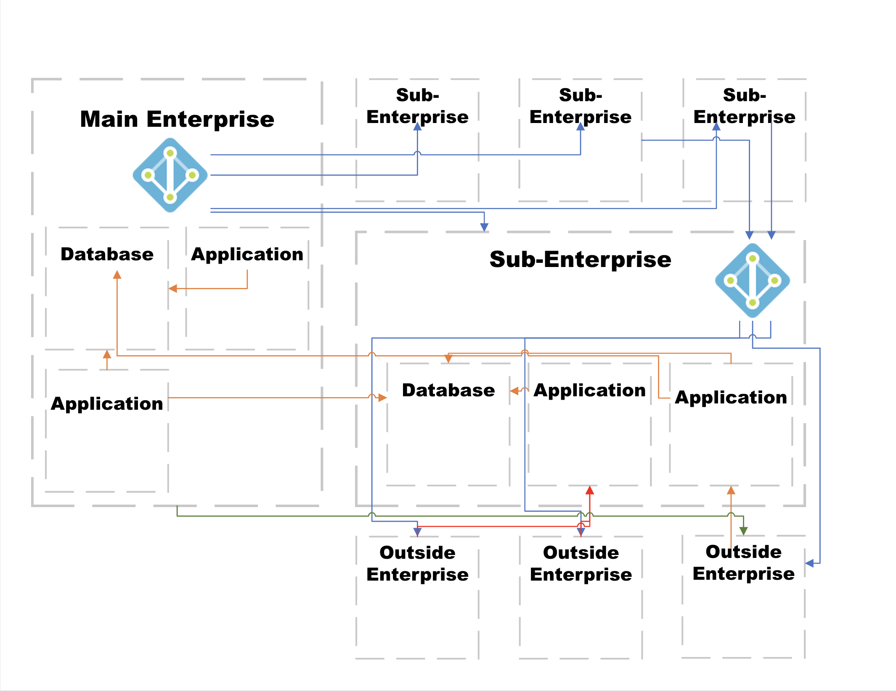

# Zero Trust / Data Centric System Build

Zero-Trust is a complicated subject. This project considers a greenfield deployment of system. No legacy enterprise network to re-architect. Let's keep it simple..

This project uses Microsoft Azure for it's build.

## Scenario

[Problem Scenario Walkthrough Shorts Playlist](https://www.youtube.com/watch?v=nRaGkLeKezc&list=PL7qVRqno0FQmduHnm6s22Yx8w-B2J6VUL)

## Requirements, Governance, and Architecture

[Requirements, Governance, and Architecture Video](https://youtu.be/lMKLizmlIKI?si=zelDpxeiQD6dU52P)

## Document References

[Secure Cloud Computing Architecture](https://rmf.org/wp-content/uploads/2018/05/SCCA_FRD_v2-9.pdf)

[NIST 800-37 Risk Management Framework](https://nvlpubs.nist.gov/nistpubs/SpecialPublications/NIST.SP.800-37r2.pdf)

[DOD ICAM Reference](https://dodcio.defense.gov/Portals/0/Documents/Cyber/DoD_Enterprise_ICAM_Reference_Design.pdf)

[DOD ZTA Reference Architecture](https://dodcio.defense.gov/Portals/0/Documents/Library/(U)ZT_RA_v2.0(U)_Sep22.pdf)

[NIST 800-207 Zero Trust Architecture](https://nvlpubs.nist.gov/nistpubs/SpecialPublications/NIST.SP.800-207.pdf)

[NIST 1800-25 Implementing Zero Trust](https://csrc.nist.gov/pubs/sp/1800/35/2prd)
